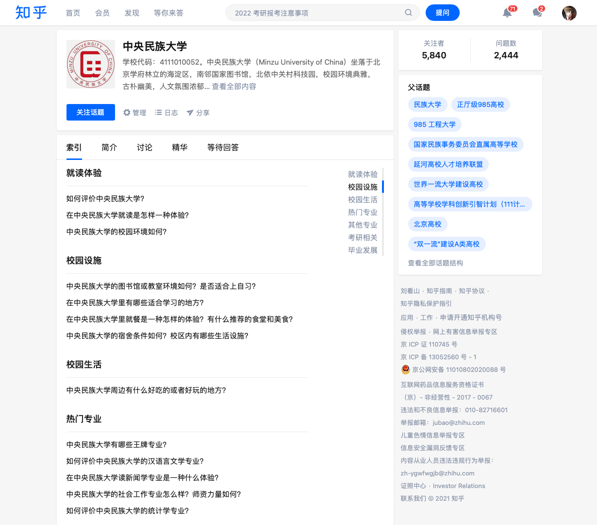
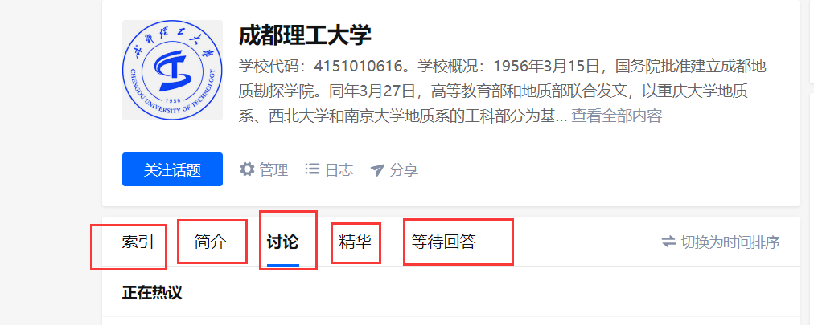
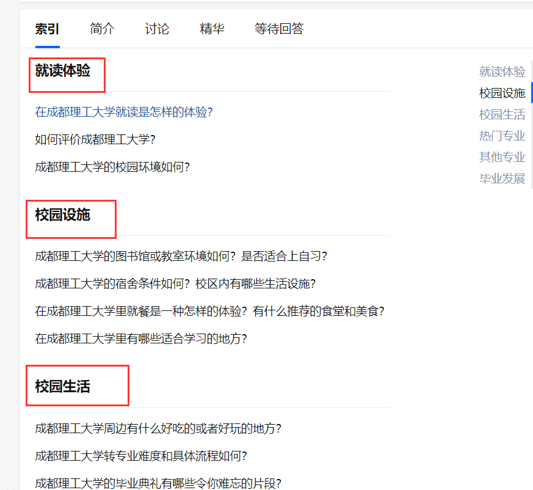
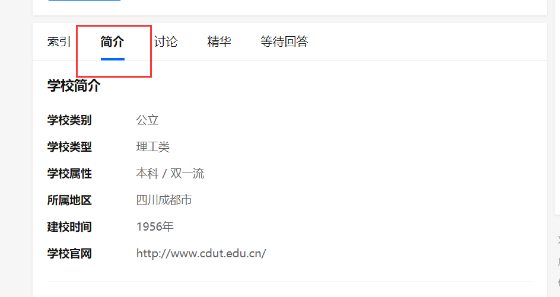
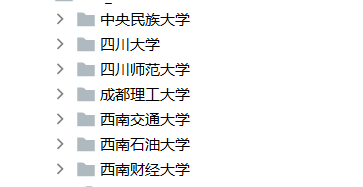
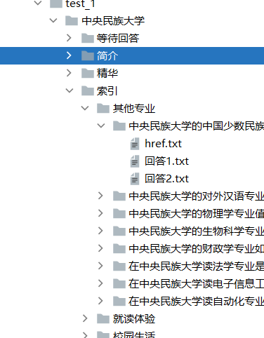

# 自然语言处理实验：实验一

编写程序自动抓取多网页内容

{{#include ../misc/author-info.html}}

日期： 2021 年 9 月 29 日

## 摘要

略

## 目录

略

## 一、实验内容

学会使用 Python（或其他编程语言）编写网络爬虫程序，能对网站格式进行解析，爬取相关内容并过滤，建立语料库。

要求：能够自动爬取多个网页，过滤掉图片、视频信息，存取文中中的 `title`，`context`，`URL` 等关键文本字段，存取到不同的文本和目录中。

提交内容：

- 实验报告
- 程序代码
- 爬取的语料

本次实验选取了问答平台 [知乎][zhihu] 作为实验对象。作为一个问答平台，知乎网站上内容的基本组成为问题，以及若干相应的答案；每个问题及问题下的回答均具有唯一的数字 URL 与之对应；此外，[知乎][zhihu] 存在话题的概念，每个话题下可以包含一系列问题。

[zhihu]: https://zhihu.com

## 二、实验原理

互联网上的网页通过超链接建立起彼此之间的联系。对于一个页面，通过检索其上存在的链接，并逐个访问这些链接、重复上述操作，就能够遍历该页面所在的整个网络。

传统的互联网页面的大多数元素通常包含在 HTML 文档源代码中，在了解了目标网站的 HTML 页面结构后，就能够如同在树上摘果子一般，从中提取自己需要的内容。

不过，现代网站多大量采用动态网页技术，以便更及时、更具针对性的向用户呈现内容，抑或作为一种反制网页爬取的对策。即，程序获取到的 HTML 源代码结构，并不是用户在浏览器中实际所看到的样子。一般来说，社交、购物网站经常使用这样的技术。若需从动态网站上获得信息，最理想的办法是使用网站方提供的应用程序接口；当这样的接口不存在时，则只能通过应用程序模拟真实用户使用浏览器时的操作，从而获得到页面上的元素。

除此之外，许多网站也会要求事先用户进行登录，之后才会提供更多信息。网站一般通过 Cookie 技术识别用户，因此可以通过在程序中使用正常登录后得到的 Cookie 来进行模拟登录。

## 三、整体框架

实验目的是获取语料。在实验开始前，要先决定目标网站上感兴趣的信息，以及存储时使用的结构。对于本次实验的对象——知乎问答社区，感兴趣的信息主要是其上的问题以及相应的答案。不过为了使获取得到的内容更具相关性，选择一个话题作为研究对象更为经济。

根据前文所述，知乎问答社区的问题具有唯一的 URL，每个问题（或问题下的某个回答）可以视作信息抓取过程中最核心的着手对象。

截止实验时，进入知乎社区的话题页，即可以得到关于话题的简介，以及话题下的热门问题。

对于某一个话题下信息的存储，设计了如下的目录结构：

```
TOPIC_ID
│
├── URL
├── DETAILS
├── SUMMARY
│
├── QUESTIONS
│   │
│   ├── QUESTION_ID_1
│   │   ├── ANSWER_ID_1
│   │   │   └── ANSWER_DETAILS
│   │   ├── ANSWER_ID_2
│   │   │   └── ANSWER_DETAILS
│   │   ....
│   │
│   ├── QUESTION_ID_2
│   │   ├── ANSWER_ID_1
│   │   │   └── ANSWER_DETAILS
│   │   ├── ANSWER_ID_2
│   │   │   └── ANSWER_DETAILS
│   │   ....
│
....
```


## 四、主要程序模块

### 程序依赖

引入依赖：

```python
import json
import os
import time
import requests
from bs4 import BeautifulSoup
from pip._vendor.distlib.compat import raw_input
from selenium import webdriver
from urllib.error import HTTPError
```

- 调用 Python 的 OS 模块用于操作主机的文件系统，用于目录建立、删除文件等操作。
- 使用 Time 模块进行计时，进而实现内容抓取操作之间具有一定的时间间隔，减少被反抓取对策侦测到的可能。
- Requests 模块用于向指定 URL 发出请求，获得到页面源代码。
- 使用 BeautifulSoup 解析 HTML 文档的结构，以便对页面中指定内容进行提取。
- Selenium 模块的 webdriver 类可以模拟用户使用浏览器时的操作，如拖动页面、点击等事件。

### 主要过程

程序主要过程如下：

```python
# 备选话题链接：

urls = [
    "https://www.zhihu.com/topic/19857419/hot", # 民大链接
    "https://www.zhihu.com/topic/19606319/hot", # 川大链接
    "https://wWw.zhihu.com/topic/19792394/hot", # 西南交大链接
    "https://www.zhihu.com/topic/19687047/hot", # 西南财大链接
    "https://www.zhihu.com/topic/19690586/hot", # 西南石油大学链接
    "https://www.zhihu.com/topic/19694756/hot", # 川师链接
    "https://www.zhihu.com/topic/19686215/hot"  # 成都理工大链接
]

url = "https://www.zhihu.com/topic/19857419/hot"

header = {
    "User-Agent": 
        "Mozilla/5.0 (Windows NT 10.0; Win64; x64) "
        "AppleWebKit/537.36 (KHTML, like Gecko) "
        "Chrome/80.0.3987.87 Safari/537.36" }

soup = fetchPageAndMakeSoup(url, header)

hrefs, paths = getFirstTitle(soup)

# 取得热门回答的链接及写入路径
href = hrefs[3]
path = paths[3]

dealWithTopAnswers(href, path)
```

### 子过程介绍

`fetchPageAndMakeSoup` 能够以指定的 `header` 爬取指定 HTTP 协议下某 URL 对应的页面源代码。之后，根据页面内容创建一个 `BeautifulSoup` 对象供后续分析使用。

```python
from urllib.error import HTTPError

def fetchPageAndMakeSoup(url, header):
    try:
        r = requests.get(url, headers=header)
        r.encoding = r.apparent_encoding
        content = r.text
    except HTTPError as e:
        return None
    bsObject = BeautifulSoup(content, "lxml")
    return bsObject
```

---

<figure>
    
    <figcaption>图 1：中央民族大学话题主页</figcaption>
</figure>

知乎话题页下的若干板块如图所示：

<figure class="image">
    
    <figcaption>图 2：知乎话题页下的若干板块</figcaption>
</figure>

`getFirstTitle` 可以从知乎话题页分析出主要的几个板块，及其对应的链接。

```python
def getFirstTitle(soup):
    # 获取一级标题：索引、简介、讨论

    titles_href = []
    titles_path = [] # 实际上存的是一级标题的路径噢！

    data = soup.find("div", id="TopicMain")
    title = data.find_all("li", class_="Tabs-item Tabs-item--noMeta")
    
    for each in title:
        print(each.find("a").contents)      # 获取 TITLE 内容：索引、简介、讨论、精华、等待回答
        print(each.find("a")['href'])       # 需要加上 zhihu.com前缀

        path_of_folder = "." + "/" + "".join(each.find("a").contents)
        createFolder(path_of_folder)

        href = "http://zhihu.com" + each.find("a")['href']
        writeHrefToFiles(path_of_folder + "/" + "href.txt", href)

        titles_href.append(href)
        titles_path.append(path_of_folder)
    
    return titles_href, titles_path
```


该函数在当前路径下（`.py` 脚本的运行处）创建目录，名称于上述二级标题相同，并且将各个 URL 以文本形式存放在相应的文件夹中。同时，通过 `titles_href` 和 `titles_path` 来对“URL 链接”和“存储路径”进行存储，以便进行后续的操作。

---

`createFolder` 函数首先判断路径下是否存在该同名目录，若不存在，则调用 `os` 模块的 `makedirs()` 方法进行创建。

```python
def createFolder(path):
    # 创建文件夹
    folder = os.path.exists(path)
    if not folder:
        os.makedirs(path)  # makedirs 创建文件时如果路径不存在会创建这个路径
        print("---  new folder...  ---")
        print("---  OK  ---")

```

---

`writeHrefToFiles` 将 href 链接写入指定路径的 TXT 文件中。

```python
def writeHrefToFiles(path, href):
    # 将 href 链接写入指定路径的 TXT 文件中
    # 使用 with open ... as f 可以保证资源在使用完成后得到释放
    with open(path, "w") as f:
        f.write(href)
```

---

处理“**索引**”标签下的内容，主要目的为获取二级标题，问题标题。获取二级标题后，便于对各个问题进行分类，便于后续进一步的处理。

<figure>
    
    <figcaption>图 3：索引选项卡下的二级标题</figcaption>
</figure>

```python
# 获取二级标题，问题标题
# 获取二级标题后，便于对各个问题进行分类，便于后续进一步的处理。
def getSecondTitle(soup, path):
    
    # 首先通过 class 标签获取二级标题，如下：
    data = soup.find("div", class_="Card TopicIndex-content")
    # details = data.find_all("h2", class_ = "TopicIndexModule-title")
    details = data.find_all("div", class_="TopicIndexModule")

    index = 1
    driver = webdriver.Firefox()

    # 通过相应的 class 获取到所有文章内容后，通过区间 for 循环遍历所有内容
    for val in details:
        # 索引标题下的子标题：就读体验，校园设施…………
        # 具体的标签如同 div h2 或者是 class 名 随着页面变化而变化
        # 此处是对大学页面下的索引进行处理。
        second_title = val.find("h2", class_="TopicIndexModule-title")
        print(second_title.contents)
        articles_titles = val.find_all("div", class_="TopicIndexModule-item")  # 多个标题
        path_of_second_title = path + "/" +"".join(second_title.contents)
        createFolder(path_of_second_title)

        for article in articles_titles:
            article_name = article.find("a").contents  # 每个标题  列表形式
            article_href = article.find("a")['href']  # 附加的 href
            print(article_name)
            print(article_href)
            print(path_of_second_title)
            path_of_article_name = path_of_second_title + "/" + "".join(article_name)
            path_of_article_name = dealWithPath(path_of_article_name)
            print(path_of_article_name)
            createFolder(path_of_article_name)
            href = "http://zhihu.com" + article_href

            # 获取了回答的名称以及链接以后
            # 由于路径可能存在不被文件系统允许的特殊符号
            # 因此需要对文件名称进行一定的处理
            path_of_href = dealWithPath(path_of_article_name + "/" + "href.txt")
            writeHrefToFiles(path_of_href, href)

            # 在存储了具体的以问题名称为名的文件夹和其 URL后，
            # 我们就可以对问题页面进行处理并且提取其中各个用户的回答，代码如下：
            time.sleep(3)
            driver.get(href)

            # 由于知乎的问题页面存在动态加载，
            # 因此需要通过 selenium 来模拟浏览器进行向下滑动页面的操作
            # 以获取所有的回答，通过 simulatePageScrolling()函数进行实现。
            simulatePageScrolling(driver ,20)
            html = driver.page_source
            soup1 = BeautifulSoup(html, 'lxml')

            # 将内容写入 TXT 文件
            writeContentToFiles(soup1, path_of_article_name)
```

`dealWithPath` 函数：`special_characters` 这一列表中包含文件系统路径不可使用的特殊符号，则对路径进行遍历，删除其中存在的特殊符号即可。

```python
def dealWithPath(path):
    # 删除路径中可能不合法的特殊字符
    special_characters = ["?", "/", ":", "*", "<", ">", "|"]
    for each in special_characters:
        path = path.replace(each, "")
    return path
```

`simulatePageScrolling` 模拟浏览器进行向下滑动页面的操作。

```python
def simulatePageScrolling(driver, times):
    for i in range(times + 1):
        driver.execute_script("window.scrollTo(0, document.body.scrollHeight);")
        time.sleep(1)
```

---

将回答写入TXT的具体实现过程如下：

```python
def writeContentToFiles(soup, path):
    articles = soup.find_all("div", class_="RichContent-inner")
    index = 1
    tag = 0
    for val in articles:
        to_path = path + "/" + "回答" + str(index) + ".txt"
        index += 1
        # if val.find("p").string is None:
        #     continue   # 无内容， 不进行处理
        with open(to_path, "w", encoding="utf-8") as f:
            for para in val.find_all("p"):
                if para.string is not None:
                    f.write(para.string)
                    f.write("\n")

        if os.stat(to_path).st_size == 0:
            os.remove(to_path)   # 删除空文件
```

此处需要注意打开文件与 `for` 循环的位置，否则会出现将多个问题写入同一个 TXT 文件中、或着将一个问题拆分成多个 TXT 文件进行存储的情况。

通过 `index` 来区分不同的回答，同时避免在写入文件时发生重名的现象。通过 `os` 模块来对文件的大小进行判断，若其大小为 0（空数据），则将该文件删除，同时应注意，此处的删除文件操作应在 `with open` 对该文件的操作完全结束后再进行。

---

接下来对简介二级标题进行操作：

<figure>
    
    <figcaption>图 4：话题页下的简介选项卡</figcaption>
</figure>

```python
def dealWithIntro(href, path):
    path_of_href = path + "\\" + "href.txt"
    path_of_txt = path + "\\" + "简介.txt"

    with open(path_of_href, "w", encoding = "utf-8") as f:
        f.write(href)

    url_intro = href
    r = requests.get(url_intro, headers=header)
    r.encoding = r.apparent_encoding
    content = r.text
    soup = BeautifulSoup(content, "lxml")
    #print(soup)
    intro_names = soup.find_all("div", class_="TopicCommonIntroTable-item")

    with open(path_of_txt, "w", encoding = "utf-8") as f:
        for val in intro_names:
            intro_name = val.find("div", class_="TopicCommonIntroTable-name")
            intro_attributes = val.find("span", class_="TopicCommonField-topicText")
            if intro_attributes is None:
                intro_attributes = val.find("div", class_="TopicCommonField-text")
            print(intro_name.contents)
            print(intro_attributes.contents)
            intro_name_str = "".join(intro_name.contents).rstrip("\n")
            #print(intro_name_str)
            f.write(intro_name_str)
            #f.write("".join(intro_name.contents).rstrip("\n"))
            f.write(":"+" ")
            #intro_attributes_str = "".join(intro_attributes.contents)
            if intro_name_str == "学校官网":                                        #进行特判
                intro_attributes_str = intro_attributes.find("a")['href']
            else:
                intro_attributes_str = "".join(intro_attributes.contents)
            #print(intro_attributes_str)
            f.write(intro_attributes_str)
            #f.write("".join(intro_attributes.contents))
            f.write("\n")
```

大部分操作于上文相同，但此处存在相同位置的内容标签不同的情况，需要对其进行特判。同时，由于学校官网的编码形式可能与其他内容的编码不同，所以在打开文件进行写操作时需要统一编码格式为“UTF-8”。

---

对“精华”选项卡进行处理：

<figure>
    
    <figcaption>图 5：话题页下的精华选项卡</figcaption>
</figure>

```python
def dealWithTopAnswers(href, path):     #处理精华标题
    driver = webdriver.Firefox()
    driver.get(href)
    simulatePageScrolling(driver, 20)
    
    html = driver.page_source
    soup = BeautifulSoup(html, 'lxml')

    # 得到热门问题的列表
    articles = soup.find_all("div", itemtype="http://schema.org/Question")

    print(articles)

    for val in articles:
        question_href = val.find("a")['href']
        quesiton_title = val.find("a").contents
        question_id = question_href[question_href.find('question/')+len('question/'):]

        print(question_href)
        print(quesiton_title)

        path_of_question = dealWithPath(path + "/" + "".join(quesiton_title))
        print(path_of_question)

        createFolder(path_of_question)

        href = "https:" + question_href
        path_of_href = dealWithPath(path_of_question + "/" + "href.txt")

        # href be like: https://www.zhihu.com/question/28580571

        writeHrefToFiles(path_of_href, href)

        time.sleep(3)

        driver.get(href)
        simulatePageScrolling(driver, 20)

        # 得到某一热门问题的页面内容
        html = driver.page_source
        soup1 = BeautifulSoup(html, 'lxml')

        # 将内容存储到文件
        # path_of_answers = path_of_article_name + "\\" + "回答" + str(index) + ".txt"
        writeContentToFiles(soup1, path_of_question)
```

大部分操作与对索引进行的操作相同，变化的仅是标签的属性，则不再进一步的阐述。

---

实验结果如下：


<figure>
    
    <figcaption>图 6：爬取结果目录结构 1</figcaption>
</figure>

<figure>
    
    <figcaption>图 7：爬取结果目录结构 2</figcaption>
</figure>

<figure>
    
    <figcaption>图 8：爬取结果内容展示</figcaption>
</figure>

另注：由于“讨论”和“等待回答”选项卡中会出现大量的同之前相同的提问，因此不再对这两个二级标题进行爬取，一方面可以加快程序的运行事件，同时减少数据的冗余量和重复度。

## 五、实验结果

详细分析实验结果，除了包含定量评价，还要有定性评价。
对存在的问题，要着重剖析。

### 实验结果的展示

本次爬虫选取的是主题是中国部分大学，选取的在知乎上较为有热度的回答。

以下使用的图片皆使用中央民族大学进行举例，其他高校结构以及爬去结果相同。

在每个文件夹依据大学主题的 5 个分支建立 5 个分文件夹，分别是索引、简介、讨论、精华和等待回答。

<figure>
    
    <figcaption>图 9：中央民族大学话题主页</figcaption>
</figure>

注：由于等待回答、讨论并非重点内容，所以文件夹下面仅有存放相应链接的 href.txt 文件。

#### 简介

简介下存储相应链接的 `href.txt` 文件和存放简介的 `简介.txt`。

#### 精华

在精华下是由问题名称构成的文件夹名。

#### 索引

在索引下是由其他专业、就读体验、校园生活、校园设施、毕业发展、热门专业和考研相关这几个子话题文件夹构成，每个子话题文件夹下面都有很多问题，其文件夹名是由问题名称构成的，并配有存储相应链接的 `href.txt` 文件。

#### 问题

每个问题下是由 txt 文本构成的回答：`回答1.txt` `回答2.txt` `回答3.txt`，以及存储相应链接的 `href.txt` 文件

### 实验结果的分析

本次实验爬取部分高校在知乎问答平台上收到的一部分评价作为语料，在练习网页抓取技术的同时，也为未来自然语言处理时提供了非常重要的原始材料。

### 存在的问题

爬取的问题比较少，信息量还有待提高，如点赞数、评论数等，未来进行舆情分析时可以增添更多可分析的要素。

## 六、总结

本次实验选择知乎问答社区为内容抓取对象。首先，程序读入待抓取的话题页链接或话题页链接列表。随后，对于每一个链接，采用 UA 模拟的方式获取到页面源代码。话题页中可以得到关于话题的简介、以及热门问题的链接。获取到以上二者后，再次抓取热门问题页面的内容，并写入到本地文件。

## 参考文献

- <https://ithelp.ithome.com.tw/articles/10225429>
- <https://marcovaldong.github.io/2016/08/18/Python爬虫爬取知乎小结/>
