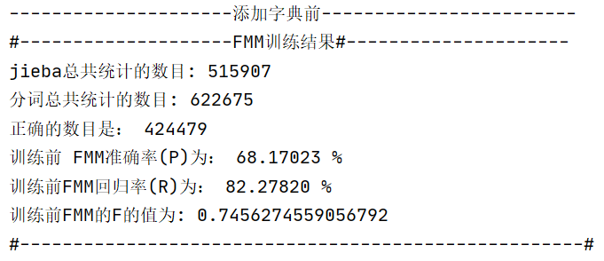
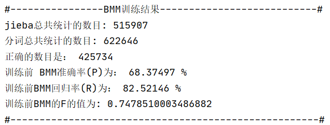
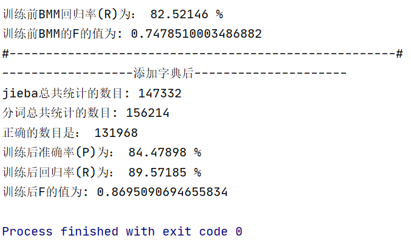

# 自然语言处理：实验二

<!-- {{#include ../misc/authors.html}} -->

{{#include ../misc/author-info.html}}

日期： 2021 年 10 月 21 日

## 摘要


## 目录

## 一、实验内容

实验内容：

- 对语料库的文本进行分词并存储。
- 分别采用正向最大匹配算法、逆向最大匹配算法进行分词。以 [jieba][jieba] 分词的分词结果作为标准语料，计算P、R、F值。

## 二、实验原理

### 基于词典的切分方法

句子 \\(S = c_1 c_2 \cdots c_n\\)：句子由若干字符 \\(c\\) 组成。

假设词 \\(w_i = c_1 c_2 \cdots c_m\\)，其中 \\(m\\) 为词典中最长词的字数。

当前的分词算法主要分为两类——基于词典的规则匹配方法和基于统计的机器学习方法。

基于词典的分词算法，本质上就是字符串匹配。将待匹配的字符串基于一定的算法策略，和一个足够大的词典进行字符串匹配，如果匹配命中，则可以分词。根据不同的匹配策略，又分为正向最大匹配法，逆向最大匹配法，双向匹配分词，全切分路径选择等。

最大匹配法（Maximum Matching, MM）主要分为三种：

- 正向最大匹配算法（Forward MM, FMM）：从左到右对语句进行匹配，匹配的词越长越好。这种方式切分会有歧义问题出现。
- 逆向最大匹配算法（Backward MM, BMM）：从右到左对语句进行匹配，同样也是匹配的词越长越好。这种方式同样也会有歧义问题。
- 双向最大匹配算法（Bi-directional MM）：则同时采用正向最大匹配和逆向最大匹配，选择二者分词结果中词数较少者。但这种方式同样会产生歧义问题。由此可见，词数少也不一定划分就正确。

**全切分路径选择**，将所有可能的切分结果全部列出来，从中选择最佳的切分路径。分为两种选择方法：

1. n 最短路径方法。将所有的切分结果组成有向无环图，切词结果作为节点，词和词之间的边赋予权重，找到权重和最小的路径即为最终结果。比如可以通过词频作为权重，找到一条总词频最大的路径即可认为是最佳路径。
2. n 元语法模型。同样采用 n 最短路径，只不过路径构成时会考虑词的上下文关系。一元表示考虑词的前后一个词，二元则表示考虑词的前后两个词。然后根据语料库的统计结果，找到概率最大的路径。

此次实验默认使用的是实验指导书中提供的词典。

### jieba 分词库

[jieba][jieba] 支持三种分词模式:

1. 精确分词，试图将句子最精确的切开，适合文本分析
2. 全模式，把句子中所有的可以成词的词语都扫描出来, 速度非常快，但是不能解决歧义
3. 搜索引擎模式，在精确模式基础上，对长词进行再次切分，提高recall，适合于搜索引擎。

[jieba]: https://github.com/fxsjy/jieba

### 扩充词典

将过程中遇到的“新词”添加进词典，可以提高文本识别的准确率。

### 准确率、召回率及 F 值

机器学习中的分类评估包含有以下这么几个概念。

准确率（Accuracy），即正确分类的数量占总的数量的比值，是一个用来衡量分类器预测结果与真实结果差异的一个指标，越接近于 1 说明分类结果越准确。

二分类的结果有以下几种可能性：

- True Positive（TP）：表示将正样本预测为正样本，即预测正确；
- False Positive（FP）：表示将负样本预测为正样本，即预测错误；
- False Negative（FN）：表示将正样本预测为负样本，即预测错误；
- True Negative（TN）：表示将负样本预测为负样本，即预测正确；

精确率（Precision）计算的是预测对的正样本在整个预测为正样本中的比重，而召回率（Recall）计算的是预测对的正样本在整个真实正样本中的比重。因此，一般来说，召回率越高，意味着模型找寻正样本的能力越强。但值得注意的是，在实际任务中，并不明确哪一类是正样本或哪一类是负样本，所以对于每个类别，都可以计算其各项指标。

\\[
\\begin{align}
\\text{Accuracy} = & \\frac{TP+TN}{TP+FP+FN+TN} \\\\
\\text{Precision} = & \\frac{TP}{TP+FP} \\\\
\\text{Recall} = & \\frac{TP}{TP+FN} \\\\
\\end{align}
\\]


实际评估一个系统时，应同时考虑 P 和 R，但同时要比较两个数值，很难做到一目了然。所以常采用综合两个值进行评价的办法，综合指标 F 值就是其中一种。计算公式如下：

\\[
\\text{F-score} = (1+\\beta^2)\\frac{P \times R}{\beta^2 \times P + R}
\\]

其中，\\(\\beta\\) 决定对 P 侧重还是对 R 侧重，通常设定为 1、2 或 \\(\\frac 1 2\\)。\\(\\beta\\) 取值为 1，即对二者一样重视，这时的 F-score 称为 \\(F_1\\) 值。

### 分词结果的评估

机器学习中二分类的评估标准，无法直接应用于分词。

在对汉语分词性能进行评估时，采用了常用的３个评测指标：准确率（P）、召回率（R）、综合指标 F 值（F）。准确率表示在切分的全部词语中，正确的所占的比值。召回率指在所有切分词语中（包括切分的和不应该忽略的），正确切分的词语所占的比值。准确率描述系统切分的词语中，正确的占多少。召回率表示应该得到的词语中，系统正确切分出了多少。计算公式如下：

\\[
P = \\frac{\\text{准确切分的词语数}}{\\text{切分出的所有词语数}}
\\]

\\[
R = \\frac{\\text{准确切分的词语数}}{\\text{应该切分的词语数}}
\\]

若一字符串的分词结果为一系列单词，设每个单词按照其在文中的起止位置可记作区间 \\(\[i,j\]\\)（\\(0\\leq i \\leq j \\leq n\\)），那么标准答案对应的所有区间就可以构成一集合 \\(A\\)，作为正类，其他的区间则作为负类;同理，根据分词结果，可以得到集合 \\(B\\)。

\\[TP \\cup FN = A \\]

\\[TP \\cup FP = B \\]

\\[A \\cap B = TP \\]

则 P、R 的计算公式：\\(\\text{Precision} = \\frac{\vert A\cap B\vert}{\vert B \vert}\\)，
\\(\\text{Recall} = \\frac{\vert A\cap B\vert}{\vert A \vert}\\)


## 三、整体框架

主要分为功能模块和使用调用。详见主要程序模块。

## 四、主要程序模块

### 功能模块设计

考虑到可能会涉及大量词语的存储与检索，尝试使用将词库载入并存储于自己实现的 Trie 字典树结构中。

为了简便起见，使用 Python 中的字典结构模拟节点对象。

[my_trie.py](./my_trie.py)

```python
{{#include my_trie.py}}
```

使用示例：

[trie_test.py](./trie_test.py)

```python
{{#include trie_test.py}}
```

从文件中加载字典到 Trie 树，以及进行最大正向匹配（FMM）、最大逆向匹配（BMM）的功能：

[FMM_BMM_trie.py](./FMM_BMM_trie.py) 

```python
{{#include FMM_BMM_trie.py}}
```

> 另有使用 Python 内建的 set 类型的版本：[FMM_BMM.py](./FMM_BMM.py)。

评估分词结果，以及计算 P、R、F 值：

[calc.py](./calc.py)

```python
{{#include calc.py}}
```

多文件处理：

[file_processing.py](./file_processing.py)

```python
{{#include file_processing.py}}
```

### 应用程序

交互式分词程序：

[demo.py](./demo.py)

```python
{{#include demo.py}}
```

打印统计信息帮助函数：

[print_helper.py](./print_helper.py)

```python
{{#include print_helper.py}}
```

对文档进行分词尝试，对最大匹配算法进行评估，并记录新词：

[train.py](./train.py)

```python
{{#include train.py}}
```

使用训练后得到的词典进行结果评估：

[test.py](./test.py)

```python
{{#include test.py}}
```

## 五、实验结果


<figure>



<figcaption>图 1：FMM 分词结果评估</figcaption>
</figure>


<figure>



<figcaption>图 2：BMM 分词结果评估</figcaption>
</figure>


<figure>



<figcaption>图 3：添加词典后分词结果（FMM）</figcaption>
</figure>

## 六、总结

### 关于如何计算正确匹配数

简单的方法是，

```python
hits += len([i for i in result if i in truth]) 
miss += [i for i in result if i not in truth]
```

使用这种方法，当一句话中出现多个相同词汇时，可能会对结果造成影响。可以根据逗号（，）等符号将语句切分为不同的小段，并对每一个小段进行处理，可以较大程度上减少相同词汇出现的概率，一定程度上保证统计的正确率。

本次实验采用了如 [calc.py](./calc.py) 中 `calc_hits` 方法的实现。

## 参考资料

- [自然语言处理 1：分词 - CSDN](https://blog.csdn.net/u013510838/article/details/81673016)
- [自然语言处理 2：jieba 分词用法及原理 - CSDN](https://blog.csdn.net/u013510838/article/details/81738431)
- [fxsjy/jieba - GitHub](https://github.com/fxsjy/jieba)
- [NLP 中文分词的评估指标 - 知乎](https://zhuanlan.zhihu.com/p/100552669)
- [Natural language processing - Wikipedia](https://en.wikipedia.org/wiki/Natural_language_processing)
