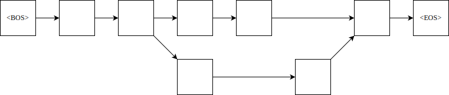

# 自然语言处理实验

<p style="text-align: center;">实验三</p>

<p style="text-align: center;">采用 2 元文法进行文本分词消歧</p>


{{#include ../misc/author-info.html}}

<p style="text-align: center;">日期： 2021 年 11 月 7 日</p>

<div style="page-break-after: always;"></div>

## 摘要


## 目录

## 一、实验内容

在使用正向、逆向最大匹配等方式进行基于字典的分词时，总会遇到具有歧义的情况。

- 对于正向、逆向最大匹配结果中的歧义问题，采用 2 元文法进行消歧，并对消歧后的文本，再次计算 P、R、F1 值；
- 利用 2 元文法计算测试语料中每段话的概率。

参考训练语料为“1998 人民日报（已分词）”，可根据需要自行修改格式，也可以在训练语料中加入 jieba 分词的结果。

提交内容：

1、实验报告（包括实验原理，主要程序流程，实验结果及分析）

2、分词后的语料（部分），概率计算结果

3、实验源代码文件 

本次实验主要做什么？

## 二、实验原理

在使用 FMM、BMM 等方式进行基于字典的分词时，总会遇到具有歧义的情况。

例如，“商品和服务”经过 FMM、BMM 分词，可以有以下的分词结果：

|分词方式|分词结果|
| :---: | :---: |
|  FMM  | \['商品', '和服', '务'\] |
|  BMM  | \['商品', '和', '服务'\] |

显然，第二种情况更为合理，因为第二种出现的概率较前一种更高。这便是统计自然语言处理。

于是，便可以通过对语言进行建模，以评估其出现的概率，进而达到消除歧义的目的。

### N-Gram

考虑到自然语言的复杂多变，语料库中不可能穷尽所有的句子，因此，直接对语句进行统计是不现实的，于是，将词视作单位便是一个自然的选择。

可以将句子表示为“单词”列表，这里的“单词”指的是统计基元。将第 \\(i\\) 个基元记作 \\(w\_i\\)，则句子 \\(s\\) 可以表示为以下形式：

\\[s = w\_1 w\_2 \\cdots w\_n\\]

其中， \\(w\_i\\) 的概率由他之前的基元 \\(w\_1, w\_2, ..., w\_{i-1}\\) 决定，也称作 \\(w\_i\\) 的历史串。

<p>\[
\begin{align}
p(s) & = p(w_1 w_2 \cdots w_n) \\
     & = p(w_1 \vert w_0) \times p(w_2 \vert w_0 w_1) \times \cdots \times p(w_{n+1} \vert w_0 w_1 \cdots w_n) \\
     & = \prod_{i=1}^{n+1}p(w_i \vert w_0 w_1 \cdots w_{i-1}) \\
\end{align}
\]</p>

上式中，\\(w\_0\\) 为句子开始的标志（Begin Of Sentence），记作 \\(\\text{\<BOS\>}\\)，\\(w\_{n+1}\\) 表示句子结束的标志（End Of Sentence），记作 \\(\\text{\<EOS\>}\\)。

但是，上述方式下，随着历史串的长度的增加，语言模型中参数 *p* 的计算代价就会变得十分昂贵。于是，我们可以只考虑前 \\(N-1\\) 个基元，以得到一个近似的概率，这时得到的语言模型就称为 *N* 元文法（*N*-Gram）。

记 \\(w\_i^j\\) 表示词 \\(w\_i\\cdots w\_j\\)，则 *N* 元文法下句子的概率可以表示为：

\\[p(s) \\approx \\prod\_{i=1}^{n+1}{p(w\_i\| w\_{i-N+1}^{i-1})p(w\_i\| w\_{i-N+1}^{i-1})} \\]

实际使用中，通常使用一元、二元、三元文法进行处理。

假设句子“John read a book”，当使用 2 元文法计算概率时，就是如下的结果：

\\[
\\begin{align}
   P(\\text{John read a book}) 
=& P(\\text{John    \| \<BOS\>}) \\times \\\\ &
   P(\\text{read    \| John   }) \\times \\\\ &
   P(\\text{a       \| read   }) \\times \\\\ &
   P(\\text{book    \| a      }) \\times \\\\ &
   P(\\text{\<EOS\> \| book   })
\\end{align}
\\]

*N*-Gram 中，\\( p(w\_i\| w\_{i-N+1}\^{i-1}) \\) 可由最大似然估计求得：

\\[
p(w\_i \| w\_{i-n+1}^{i-1})
= f(w\_i \| w\_{i-n+1}^{i-1})
= \\frac{c(w\_{i-n+1}^{i})}{ \\sum_{w}{c(w\_{i-n+1}^{i-1} w)} }
\\]

公式中的 \\(w\\) 表示任意词，因此 \\(\\sum_{w}{c(w_{i-n+1}^{i-1} w)}\\) 实际上就是 \\( w\_{i-n+1}^{i-1} \\) 在训练语料中的出现次数，即 \\(c(w\_{i-n+1}^{i-1})\\)。\\( f(w\_i \| w\_{i-n+1}^{i-1}) \\) 是在给定 \\( w\_{i-n+1}^{i-1} \\) 的条件下，\\(w\_i\\) 出现的相对频度。

假设给定训练语料：

```
John read Moby Dick
Mary read a different book
She read a booky by Cher
```

\\[
\\begin{align}
& P(\\text{John}    \| \\text{\<BOS\>}) = \\frac{ c( \\text{\<BOS\> John} ) }{ c( \\text{\<BOS\>} ) } = \\frac 1 3 \\\\
& P(\\text{read}    \| \\text{John}   ) = \\frac{ c( \\text{John read}    ) }{ c( \\text{John}    ) } = \\frac 1 1 \\\\
& P(\\text{a}       \| \\text{read}   ) = \\frac{ c( \\text{read a}       ) }{ c( \\text{read}    ) } = \\frac 2 3 \\\\
& P(\\text{book}    \| \\text{a}      ) = \\frac{ c( \\text{a book}       ) }{ c( \\text{a}       ) } = \\frac 1 2 \\\\
& P(\\text{\<EOS\>} \| \\text{book}   ) = \\frac{ c( \\text{book \<EOS\>} ) }{ c( \\text{book}    ) } = \\frac 1 2
\\end{align}
\\]

则 \\(P(\text{John read a book}) = \frac 1 3 \times 1 \times \frac 2 3 \times \frac 1 2 \times \frac 1 2 \\approx 0.06 \\)。

考虑句子“Cher read a book”，可得 \\( P(\text{Cher read a book}) = 
P(\text{Cher}    \| \text{\<BOS\>}) \\times
P(\text{read}    \| \text{Cher}   ) \\times
P(\text{a}       \| \text{read}   ) \\times
P(\text{book}    \| \text{a}      ) \\times
P(\text{\<EOS>\} \| \text{book}   ) \\)。

又 
\\[
\\begin{align}
& P(\text{Cher}    \| \text{\<BOS\>}) = \\frac{ c( \\text{\<BOS\> Cher} ) }{ c( \\text{\<BOS\>} ) } = \\frac 0 3, \\\\
& P(\text{read}    \| \text{Cher}   ) = \\frac{ c( \\text{Cher read}    ) }{ c( \\text{Cher}    ) } = \\frac 0 1
\\end{align}
\\]

最终得 \\(P(\text{Cher read a book}) = 0\\)。

### 数据平滑

在上面的例子中，由于数据匮乏，导致了零概率问题。对此，需要使用数据平滑来调整最大似然估计得概率值，使零概率增值，使非零概率下调，从而消除零概率，提高模型的整体正确率。

一种简单的方法即为加 1 法，即将每一种情况出现的次数加 1。在 1 元文法（uni-gram）下，设有 \\(w\_1, w\_2, w\_3\\) 三个词，概率分别为：1/3, 0, 2/3，则“加 1”后，它们的概率变为 2/6, 1/6, 3/6（由于每个词的数量都增加了 1 个，词的总数变为了 6，因此分母为 6）。

对于 2 元文法，假定所有语料的词汇量（全部可能的基元数）为 *V*，则 \\( P(w\_i \| w\_{i-1}) = \\frac{1+c(w\_{i-1}w\_i)}{\|V\| + c(w\_{i-1})} \\)。

### 训练

训练过程即为统计二元语法频次以及一元语法频次，建立相应的统计语言模型。


训练文本通常由一个或多个句子组成。比如，训练样本有下面这样的语句：

```text
一 只 黑叶猴 和 一 只 灰叶猴 因 吃 了 游客 投 喂 的 食物 ， 腹泻 、 腹胀 而 死 。
```

这样以间隔符间隔开的语句可以视作列表的形式：

```
[ '一', '只', '黑叶猴', '和', '一', '只', 
  '灰叶猴', '因', '吃', '了', '游客', 
  '投', '喂', '的', '食物', '，', 
  '腹泻', '、', '腹胀', '而', '死', '。' ]
```

本实验计划以短句作为句子的单位，并规定了一组用于断句的标点符号。

```python
punctuations = {',', '，', ';', '；', '。', '!', '！', '?', '？', '（', '）', '—'}
```

根据二元文法对列表中的词进行匹配，可以得到下边的结果：

```
[ ('<BOS>', '一只'), ('一只', '黑叶猴'), ('黑叶猴', '和'), ('和', '一只'), 
  ('一只', '灰叶猴'), ('灰叶猴', '因'), ('因', '吃'), ('吃', '了'), 
  ('了', '游客'), ('游客', '投'), ('投', '喂'), ('喂', '的'), ('的', '食物'), 
  ('食物', '<EOS>'), ('<BOS>', '腹泻'), ('腹泻', '腹胀'), ('腹胀', '而'), 
  ('而', '死'), ('死', '<EOS>') ]
```

将这些元组交与用于训练二元文法模型的函数。

按照行来读取文本，并将列表形式的数据

### 消除歧义

对于某一句话，不同的分词方法，可能会得到不同的结果。结果中的不同之处被视作“歧义”。为了得到相对情况下最为准确的分词结果，需要在每处歧义选择最佳的词元组合。

我们可以将不同分词结果中的分词情况表示在一张图上。

下面以对“他是研究生物的”的两种分词结果为例。

|分词方式|分词结果|
| :---: | :---: |
|  FMM  | \['他', '是', '研究生', '物', '的'\] |
|  BMM  | \['他', '是', '研究', '生物', '的'\] |

上面两种分词结果可以形成一无环有向图，即下图所示的网络结构。



图上任意一条有向边代表的转化关系，即是该边连结的起始结点的词语 \\(c\_1, c\_2\\) 在二元文法下的概率 \\(p(c\_2 \|c\_1)\\)。我们希望找到概率最大的句子，即从起点到终点的一条路径，其经过的边代表的概率之积最大；若我们将图上的每一条边的权值定为概率 \\(p\\) 的负对数，则求最大概率乘积的问题可以转变为图上的最短路问题。

## 三、整体框架

通过编程，构建了二元文法模型以及词图模型。

首先使用对语料的分词结果（训练材料）对二元文法模型进行训练。

之后，结合词库使用 FMM、BMM 算法进行分词，根据分词结果生成词图，并通过词图得到所有可能的组合，并为每种组合计算概率，求出概率最高的情况，作为“消歧”后的结果。

## 四、主要程序模块

详细介绍各个主要模块的功能及实现流程。

### 二元语法模型

[bigram_model.py](./bigram_model.py)

```python
{{#include bigram_model.py}}
```

### 词图建立

[word_map.py](./word_map.py)

```python
{{#include word_map.py}}
```

词图建立用法说明：[word_map_test.py](word_map_test.py)

```python
{{#include word_map_test.py}}
```

### 打印帮助

[print_helper.py](./print_helper.py)

```python
{{#include print_helper.py}}
```

### 测试程序

[bigram_model_test.py](./bigram_model_test.py)

```python
{{#include bigram_model_test.py}}
```


## 五、实验结果

详细分析实验结果，除了包含定量评价，还要有定性评价。
对存在的问题，要着重剖析。

## 六、总结

除了对整个实验进行概要总结，如果有程序亮点，可以在这阐述。

## 参考文献

如有参考文献，请附上。

- <https://leimao.github.io/blog/Maximum-Likelihood-Estimation-Ngram/>
- [HanLP《自然语言处理入门》笔记 - 3. 二元语法与中文分词 mantch - CSDN 博客](https://blog.csdn.net/weixin_41510260/article/details/104187534)

