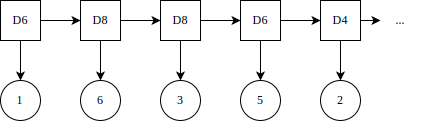
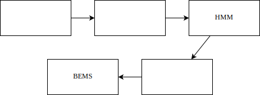
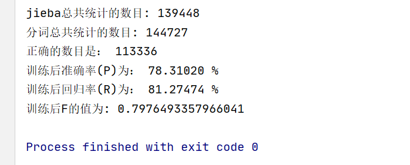
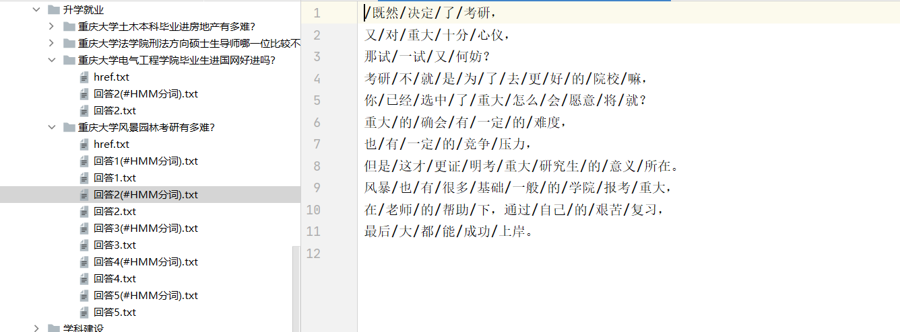
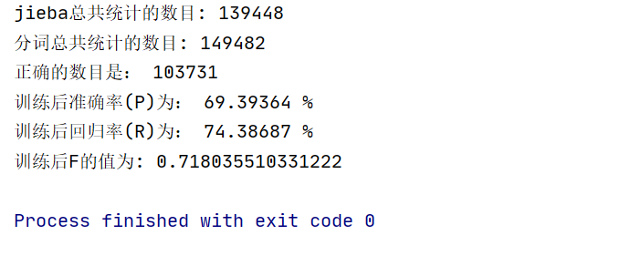
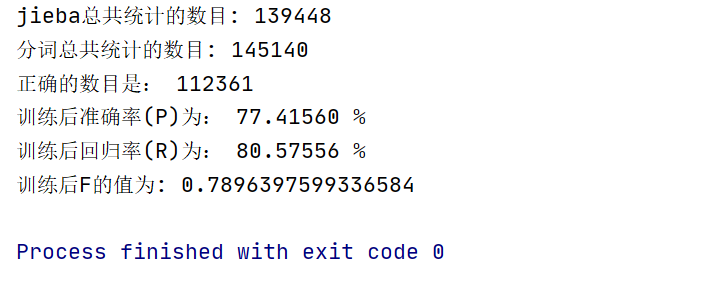
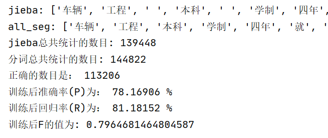
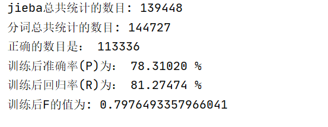

# 自然语言处理实验

<p style="text-align: center;">实验四</p>

<p style="text-align: center;">基于 HMM 的文本分词</p>


{{#include ../misc/author-info.html}}

<p style="text-align: center;">日期： 2021 年 12 月 2 日</p>

<div style="page-break-after: always;"></div>


## 目录

## 一、实验内容

采用一阶隐马尔可夫模型（HMM）进行分词

- 利用训练语料得到 HMM 模型，采用 B、M、E、S 标记，完成分词；
- 计算 P、R、F1 值。

参考训练语料为“1998 人民日报（已分词）”，可根据需要自行修改格式，也可以在训练语料中加入 jieba 分词的结果。

## 二、实验原理

### 马尔可夫模型

如果一个系统有 *N* 个状态 \\( S\_1, S\_2, ..., S\_N\\)，随着时间的推移，该系统从某一状态转移到另一状态。系统在时间 *t* 的状态记为 \\(q_t\\)。系统在时间 *t* 处于状态 \\(S\_j (1 \\leq j \\leq N)\\) 的概率取决于其在时间 1, 2, ..., \\(t-1\\) 的状态，该概率为：

\\[
P(q\_t = S\_j \| q\_{t-1} = S\_i, q\_{t-2} = S\_k, ...)
\\]

如果在特定情况下，系统在时间 *t* 的状态只与其在时间 \\(t-1\\) 的状态相关，则该系统构成一个离散的一阶马尔可夫链，其概率可以表示为：

\\[
P(q\_t = S\_j \| q\_{t-1} = S\_i)
\\]

比如天气预测，如果我们知道“晴天，多云，雨天”之间的转换概率，那么如果今天是晴天，我们就可以推断出明天是各种天气的概率，接着后天的天气可以由明天的进行计算。这类问题可以用 Markov 模型来描述。

如果只考虑上述公式独立于时间 *t* 的随机过程（不动性假设），即状态与时间无关，那么：

\\[ P(q\_t = S\_j \| q\_{t-1} = S\_i) = a\_{ij}, 1 \\leq i, j \\leq N \\]

其中，\\(a\_{ij}\\) 称为状态转移概率，该随机过程称为**马尔可夫模型**。

在马尔可夫模型中，状态转移概率 \\(a\_{ij}\\) 必须满足下列条件：

\\[ \\begin{cases} 
    & a\_{ij} \\geq 0, \\\\ 
    & \\sum\_{j=1}^{N}{a\_{ij}} = 1
\\end{cases} \\]

马尔可夫模型又可视为随机有限状态机，该有限状态机的每一个状态转换过程都有一个相应的概率，表示自动机采用这一状态转换的可能性。

马尔可夫链可以表示为状态图，则每个节点上所有发出弧的概率之和等于 1。

### 状态序列

状态序列 \\( S\_1, S\_2, ..., S\_T \\) 的概率可由下列公式计算。

\\[
\\begin{align}
P(S\_1, S\_2, ..., S\_T)
& = P(S\_1) P(S\_2 \| S\_1) P(S\_3 \| S\_1, S\_2) \\cdots P(S\_T|S\_1, S\_2, ..., S\_{T-1}) \\\\
& = P(S\_1) P(S\_2 \| S\_1) P(S\_3 \| S\_2) \\cdots P(S\_T \| S\_{T-1}) \\\\
& = \\pi_{S\_1}\prod\_{t=1}^{T-1}{a\_{S\_t S\_{t+1}}}
\\end{align}
\\]

其中，\\(\\pi\_k\\) 表示初始状态为 \\(k\\) 的概率。

### 隐马尔可夫模型

隐马尔可夫模型（Hidden Markov Model, HMM） 是一个双重随机过程，我们知道状态转移的概率，但不知道具体的状态序列、无法看到模型的状态转换过程，只能观察到隐蔽的状态转换过程的随机函数。

举个例子，有三个不同的骰子，分别是六面体骰子（记作 D6，有 1 ~ 6 六个面，每个面出现的概率是 \\(\\frac 1 6\\)）、四面体骰子（记作 D4，有 1 ~ 4 四个面，每个面出现的概率是 \\(\\frac 1 4\\)）以及八面体骰子（记作 D8，有 1 ~ 8 八个面，每个面出现的概率是 \\(\\frac 1 8\\)）。

接下来，假设投掷 10 次骰子，每次选择其中一个骰子，投掷得到的数字是 1 ~ 8 中的一个。这个过程中，我们无法观测到时使用哪个骰子投掷，仅仅能看到投掷的结果，也就是一串 1 到 8 之间的数字。这串数字即是可见状态链，而过程中每次掷出数字的骰子所形成的序列即为隐含状态链。



一般来说，HMM 中的马尔科夫链指的是隐含状态链，因为隐含状态之间存在转换概率（transition probability）。在上述掷骰子的例子中，若每次随机选择骰子，则转换概率矩阵中的值均为 \\(\\frac 1 3\\)。

此外，尽管可见状态之间没有转换概率，但是隐含状态和可见状态之间存在输出概率（emission probability）。比如，六面体骰子 D6 掷出数字 1 ~ 6 的概率均为 \\(\\frac 1 6\\)。

### BEMS 标注

对于中文分词结果中的每一个字，我们可以使用 B、E、M、S 来进行标注。其中，B代表词语中的起始字，M 代表词语中的中间字，E 代表词语中的结束字，S 则代表单字成词的字。

因此，我们可以用 B、E、M、S 组成的序列串来表示分词的结果。比如，有下面这样的分词结果：

> 一/只/黑叶猴/吃/了/游客/投喂/的/食物

则该结果对应的序列串为：

| S | S | BME | S | S | BE | BE | S | BE |
|:-:|:-:|:---:|:-:|:-:|:--:|:--:|:-:|:--:|
| 一 | 只 | 黑叶猴 | 吃 | 了 | 游客 | 投喂 | 的 | 食物 |

如果要用 HMM 模型解决分词问题，则目标的 BEMS 序列即为模型的隐藏状态序列，而待分词的语句则为观测得到的序列。

### HMM 模型应用

对于 HMM 来说，如果已知所有隐含状态之间的转换概率，和所有隐含状态到所有可见状态之间的输出概率，是很容易模拟某个过程的。但实际应用 HMM 时，往往是缺失了一部分信息的，比如，有时候已知骰子的种类数、每种骰子可能掷出的状态，但是不知道掷出来的骰子序列；有时候仅有很多次掷骰子的结果，其余的信息均为未知状态。如何应用算法去估计这些缺失的信息，是一个很重要的问题。

### 解决分词问题

和 HMM 模型相关的算法主要分为三类。而要解决分词的问题，其实类似于已知结果序列（可见状态链）、骰子的数量及类型（隐含状态数量、发射概率）以及转换概率，而求每次掷出的骰子种类（隐藏状态链）。

我们知道，根据某一骰子序列，我们可以求得掷出某一结果序列的概率。

比如 D6、D8、D8 掷出序列 1、6、3 的概率为：

\\[
P = P(D6) P(D6 \\to 1) P(D8 \| D6) P(D8 \\to 6) P(D8 \| D8) P(D8 \\to 3)
\\]

而要找到掷出某一结果序列的最可能的骰子序列，理论上可以穷举出所有的骰子序列，分别计算出它们掷出该结果的概率，则最高概率对应的骰子序列即为最可能的骰子序列。

若模型有 *N* 个状态，观察序列长度为 *T*，则可能的隐藏状态序列有 \\(N^T\\) 种。随着长度 *T* 的增长，可能的状态序列数呈指数级增长，几乎无法计算。

假设只掷一次骰子，结果为 1，则最可能掷出该结果的骰子为 D4，其概率为 \\(\\frac 1 4\\)，大于 D6 的 \\(\\frac 1 6\\) 和 D8 的\\(\\frac 1 8\\)。

接下来，若掷两次骰子，结果为 1、6。我们希望得知掷出该结果的最可能的骰子序列，亦即掷出该结果的概率最大的骰子序列。显然，要取得最大概率，第一个骰子必须是 D4，此时，我们需要分别计算第二个骰子是 D4、D6、D8 时掷出该结果的概率。

第二个骰子是 D4 时，掷出该结果的概率：

\\[P = P(D4) P(D4 \\to 1) P(D4 \| D4) P(D4 \\to 6) \\]

第二个骰子是 D6 时，掷出该结果的概率：

\\[P = P(D4) P(D4 \\to 1) P(D6 \| D4) P(D6 \\to 6) \\]

第二个骰子是 D8 时，掷出该结果的概率：

\\[P = P(D4) P(D4 \\to 1) P(D8 \| D4) P(D8 \\to 6) \\]


可以得出，当第二个骰子为 D6 时，掷出该结果的概率最大。

当掷三次骰子、结果序列为 1、6、3 时，根据之前的推算能够得知，要得到最大的概率，前两个骰子必须为 D4、D6。如此的思路适用于投掷任意次骰子。

而对于分词问题，我们可以认为 B、E、M、S 为四种可能的隐状态，每种隐状态有一初始概率，每种隐状态之间存在转移概率，每个状态可能产生出若干显状态（发射概率），

### 定义 HMM 模型

将转移概率矩阵记作 *A*，其中每个元素 \\(a\_{ij}\\) 表示状态 \\(S\_i\\) 转向 \\(S\_j\\) 的概率。

\\[ \\begin{cases} 
    & a\_{ij} = P(q\_{t+1}=S\_j\|q\_t=S\_i) \\\\ 
    & a\_{ij} \\geq 0 \\\\ 
    & \\sum\_{j=1}^{N}{a\_{ij}} = 1
\\end{cases}, 1 \\leq i, j \\leq N \\]

将发射概率记作 *B*，其中每个元素 \\(b\_j(k)\\) 表示从状态 \\(S\_j\\) 观察到符号 \\(v\_k\\) 的概率。

\\[ \\begin{cases} 
    & b\_j(k) = P(O\_t = v\_k \| q\_t = S\_j) \\\\ 
    & b\_j(k) \\geq 0 \\\\ 
    & \\sum\_{k=1}^{M}{b\_j(k)} = 1
\\end{cases}, 1 \\leq j \\leq N, 1 \\leq k \\leq M \\]

初始概率记作 \\(\\pi\\)，其中 \\(\\pi\_k\\) 表示初始状态为 \\(k\\) 的概率。

\\[
\\begin{cases}
& \\pi\_i = P(q\_1 = S\_i) \\\\
& \\pi\_i \\geq 0 \\\\
& \\sum\_{i=1}^{N}{\\pi\_i} = 1
\\end{cases}, 1 \\leq i \\leq N
\\]

为了方便，一般将 HMM 记为 \\( \\mu = (A,B,\\pi) \\)。

## 三、整体框架

<figure>


    <figcaption>图 1：程序流程图</figcaption>
</figure>

## 四、主要程序模块

### 文件操作

通过 `file_glob()` 函数调用获得到指定目录下的所有文件。 

```python
def file_glob(path):
    """
    获得目录下的所有文件
    :param path: 目录名
    :return: 文件名（生成器）
    """
    ignore = ['href', '简介', 'segmented', '#']
    for root, subdirs, files in os.walk(path):
        for f in files:
            file_name = os.path.join(root, f)

            # 如果文件名含有某些特征，跳过
            should_pass = False
            for kw in ignore:
                if file_name.find(kw) != -1:
                    should_pass = True
                    break
            if should_pass: continue
                    
            yield file_name

```


### 矩阵初始化

通过`init_matrix()` 函数调用对矩阵进行初始化，在训练过程中分别对 `start_prob_matrix`、`trans_prob_matrix`、`trans_prob_matrix` 进行计算。 

```python
def init_matrix(file_path):
    global character_count

    with open(file_path, "r", encoding="utf-8") as f:
        global character_count
        contents = f.read()
        arr_contents = get_jieba_contents(contents)
        #print(arr_contents)
        sentences = get_each_sentence(" ".join(arr_contents))
        #print(sentences)
        for sentence in sentences:
            handle_sentence(sentence)
```


通过 `calculate_probability()` 函数调用来对各个矩阵进行计算。

```python
def calculate_propability():
    # 根據出現的字符的總個數來計算 概率
    divisor = sum(start_probability_matrix.values())
    for key in start_probability_matrix:

        if start_probability_matrix[key] != 0:
            start_probability_matrix[key] /= divisor
            start_probability_matrix[key] = math.log(start_probability_matrix[key])
        else:
            start_probability_matrix[key] = -3.14e+100


    for key_1 in trans_probability_matrix:
        divisor = sum(trans_probability_matrix[key_1].values())
        for key_2 in trans_probability_matrix[key_1]:
            if trans_probability_matrix[key_1][key_2] != 0:
                trans_probability_matrix[key_1][key_2] /= divisor
                trans_probability_matrix[key_1][key_2] = math.log(trans_probability_matrix[key_1][key_2])
            else:
                trans_probability_matrix[key_1][key_2] = -3.14e+100


    for key in emit_probability_matrix:
        divisor = sum(emit_probability_matrix[key].values())
        for character in emit_probability_matrix[key]:
            emit_probability_matrix[key][character] /= divisor
            if emit_probability_matrix[key][character] != 0:
                emit_probability_matrix[key][character] = math.log(emit_probability_matrix[key][character])
            else:
                emit_probability_matrix[key][character] = -3.14e+100
```


```python
def handle_sentence(sentence):
    #對 單個句子進行處理
    sentence = sentence.split(" ")

    if len(sentence) == 1 and sentence[0] in special_character:  # 特殊符號，跳過不予理會
        return None

    else:
        temp_pattern = None
        print(sentence)
        for word in sentence:
            if word in special_character:
                continue
            print(word)
            if temp_pattern == None:
                temp_pattern = handle_single_first_word(word, temp_pattern)     #處理句子開頭的字
                print("開頭：", word)

            else:
                temp_pattern = handle_single_word(word, temp_pattern)           #處理句子其他地方的字

```

### 变量初始化

其中， `split_character` 中的字符用于将文章按照指定的分隔符划分为一个个的短句。`special_character`中的字符用于将文字间的特殊符号去除掉，以便于接下来的分词操作。`training_file_path` 用于存储训练集的路径；`test_file_path`用于存储测试时所需数据的路径。 

```python
split_character = "(（|。|\(|\)|！|\!|\.|？|\?|\,|\，|）|\n)"
special_character = ["(", ")", "（", "）", "\"", "\'","/", "\\", ".", "。", "、", "\n", "", " ","【", "】", "｀", "✪", "①", "②", "③", "▽","，", "\n", "\r","”", "：" , '，', "~", "-","[", "]", "{", "}", "？"]

trainning_file_path = [".\\成都理工大学", ".\\四川大学", ".\\四川师范大学", ".\\西南财经大学", ".\\西南交通大学",
                 ".\\西南石油大学", ".\\中央民族大学"]

test_file_path = [".\\重庆大学", ".\\西华大学"]
PrevStatus = {
    'B': 'ES',
    'M': 'MB',
    'S': 'SE',
    'E': 'BM'
}                                   #可能存在的状态转换
MIN_FLOAT = -3.14e+100
```


### Viterbi 算法

在 `Viterbi` 算法中，我们将概率通过 `log()` 函数进行处理，使得其在路径的计算过程中，将概率相互之间的乘法转变为了对数值之间的加法。

有几个地方需要注意的是，在开头时字的状态只会是 B 或者是 S； 在句末处，字的状态只会是 S  或者 E 。

另外，状态转移时应该满足 PrevStatus 的条件，即某些状态之间无法完成相互转换(如 B ---> B)。

```python
def viterbi(obs, states, start_p, trans_p, emit_p):
    V = [{}]  # tabular
    path = {}
    for y in states:  # init
        V[0][y] = start_p[y] + emit_p[y].get(obs[0], MIN_FLOAT)
        path[y] = [y]
    for t in range(1, len(obs)):
        V.append({})
        newpath = {}

        for y in states:
            em_p = emit_p[y].get(obs[t], MIN_FLOAT)
            (prob, state) = max(
                [(V[t - 1][y0] + trans_p[y0].get(y, MIN_FLOAT) + em_p, y0) for y0 in PrevStatus[y]])
            V[t][y] = prob
            newpath[y] = path[state] + [y]
        path = newpath

    (prob, state) = max((V[len(obs) - 1][y], y) for y in 'ES')

    return (prob, path[state])
```


### 分词操作

根据 "BEMS" 状态的特性即可以完成分词，不再过多的进行阐述。

```python
def foo(obs_seq, bems_seq):
    out = []
    s = ''
    for ch, tag in zip(obs_seq, bems_seq):
        if tag == 'S':
            out.append(ch)
        elif tag != 'E':
            s += ch
        else:
            s += ch
            out.append(s)
            s = ''
    return out

```


### 文件写出

部分代码如下：

```python
def file_write(filepath):
    result = "/"
    all_seg = []
    for val in contents_1:
        if val in special_character:
            result += val
            all_seg += [val]
            continue
        else:
            val = [i for i in val if i not in special_character]
            if len(val) == 0:
                continue
            seq = \
            viterbi(val, "BMES", start_probability_matrix, trans_probability_matrix, emit_probability_matrix)[1]
            seg_list = foo(val, seq)
            result += "/".join(seg_list)
            all_seg += seg_list
   
	with open(new_file_path, "w", encoding="utf-8")as f:
        f.write(result)
```


### PRF 计算

统计词数然后即可计算 P、R、F 值，不再阐述。

```python
def calculate_precision(jieba_arr, generated_arr):
    global all_counts1
    global all_counts2
    global correct_counts
    start1 = 0
    end1= len(jieba_arr)

    start2 = 0
    end2 = len(generated_arr)

    while(True):
        index1 = -1
        try:
            index1 = jieba_arr.index("，",start1, end1)          #在未找到时可能会报错，TRY包住
        except:
            pass
        finally:
            pass
        temp_arr1 = [i for i in jieba_arr[start1: index1: 1] if i not in special_character]
        start1 = index1 + 1
        all_counts1 += len(temp_arr1)
        index2 = -1
        try:
            index2 = generated_arr.index("，", start2, end2)     #理由同上
        except:
            pass
        finally:
            pass
        temp_arr2 = [i for i in generated_arr[start2: index2: 1]if i not in special_character]     #去掉特殊符号
        start2 = index2 + 1
        all_counts2 += len(temp_arr2)
        correct_counts += len([i for i in temp_arr2 if i in temp_arr1])    
        if index1 == -1 or index2 == -1:
            break
```


## 五、实验结果

<figure>


    <figcaption>图 2：分词结果统计</figcaption>
</figure>

<figure>


    <figcaption>图 3：分词结果展示</figcaption>
</figure>

### 不同训练语料的对比

<table>
<tr>
<td><figure>


    <figcaption>图 4：使用 1 份量语料训练的结果</figcaption>
</figure>
</td>
<td><figure>


    <figcaption>图 5：使用 3 份量语料训练的结果</figcaption>
</figure>
</td>
</tr>
<tr>
<td><figure>


    <figcaption>图 6：使用 5 份量语料训练的结果</figcaption>
</figure>
</td>
<td><figure>


    <figcaption>图 7：使用 7 份量语料训练的结果</figcaption>
</figure>
</td>
</tr>
</table>


观察可得，随着训练语料数量的增加，最开始的效果提升较为显著，而当训练语料数量达到一定程度时，结果的提升不再明显。

## 六、总结

收获颇丰。

## 参考文献

如有参考文献，请附上。

- [一文搞懂 HMM (隐马尔可夫模型) - 博客园](https://www.cnblogs.com/skyme/p/4651331.html)
- [HMM (隐马尔科夫模型) 用于中文分词 - 简书](https://www.jianshu.com/p/0eee07a5bf38)
- [一个隐马尔科夫模型的应用实例：中文分词 - 简书](https://www.jianshu.com/p/f140c3a44ab6)
- [基于 HMM 的中文分词](https://blog.csdn.net/taoyanqi8932/article/details/75312822)
- [Entropy (information theory)](https://en.wikipedia.org/wiki/Entropy_(information_theory))
- [Hidden Markov model](https://en.wikipedia.org/wiki/Hidden_Markov_model)
- [Forward algorithm](https://en.wikipedia.org/wiki/Forward_algorithm)
- [Viterbi algorithm](https://en.wikipedia.org/wiki/Viterbi_algorithm)
